  

折腾 RAG 和 Agent，做一点开发工具，也把过程写下来。

  <a href="https://www.asterh.me/">个人博客</a> ·
  <a href="https://github.com/HuangJingwang?tab=repositories">全部项目</a> ·
  <a href="https://github.com/HuangJingwang/practical-tech-writing">技术写作</a>

Java &nbsp; / &nbsp; Python &nbsp; / &nbsp; TypeScript &nbsp; / &nbsp; Kotlin &nbsp; / &nbsp; RAG &amp; MCP

 

## 项目

| 项目 | 在做什么 |
| :--- | :--- |
| **[RAG Knowledge Lab](https://github.com/HuangJingwang/rag-knowledge-lab)** | 可视化探索原文、Chunk、向量检索与知识图谱 |
| **[Executable DDD](https://github.com/HuangJingwang/executable-ddd)** | 把 DDD 边界落到 Java 代码、测试和可执行约束 |
| **[Easy Yapi · Micronaut](https://github.com/HuangJingwang/easy-yapi-micronaut)** | 为 easy-yapi 增加 Micronaut 注解识别与 JDK 21 支持 |
| **[Change Crew](https://github.com/HuangJingwang/change-crew)** | 面向编码 Agent 的多智能体交付工作流 |

 

## 贡献

<picture>
  <source media="(prefers-color-scheme: dark)" srcset="./assets/contribution-snake-dark.svg?v=live" />
  
</picture>

查看公开数据

 

取自 GitHub 公开 API，每 6 小时尝试刷新；语言按仓库主语言数量统计。

 

## 笔记与工具

**[Aster.H](https://www.asterh.me/)** · 技术、项目，也记一点日常。 
**[Practical Tech Writing](https://github.com/HuangJingwang/practical-tech-writing)** · 有事实依据、表达自然的中文技术写作 Skill。 
**[BrushUp](https://github.com/HuangJingwang/brushup)** · 刷题同步、间隔复习与 AI 代码分析。

 

好奇的东西，写个 demo 看看。

