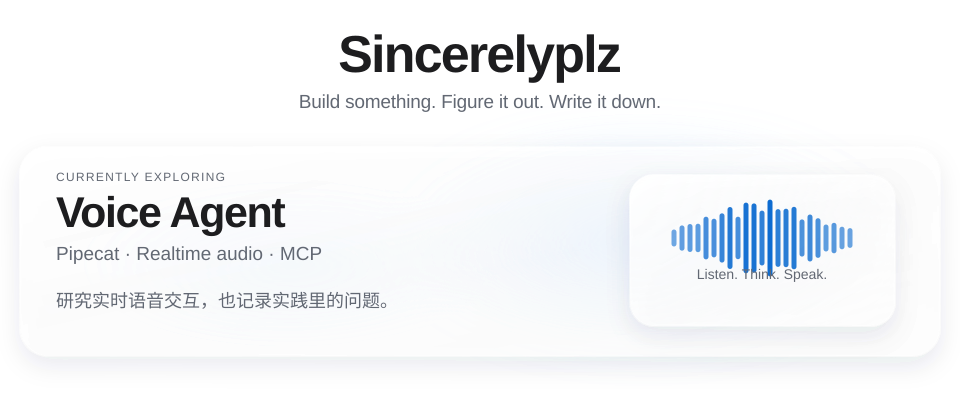

<picture>
  <source media="(max-width: 600px) and (prefers-color-scheme: dark)" srcset="./assets/voice-header-dark-mobile.svg" />
  <source media="(max-width: 600px)" srcset="./assets/voice-header-mobile.svg" />
  <source media="(prefers-color-scheme: dark)" srcset="./assets/voice-header-dark.svg" />
  
</picture>

最近在研究 **Voice Agent**，用 Pipecat 折腾实时语音交互，也在做 RAG、会议助手和开发工具。遇到有意思的问题，就写下来。

[个人博客 ↗](https://www.asterh.me/) &nbsp; · &nbsp; [项目代码 ↗](https://github.com/HuangJingwang?tab=repositories) &nbsp; · &nbsp; [技术写作 ↗](https://github.com/HuangJingwang/practical-tech-writing)

 

### Voice Agent，最近在研究的事

让 Agent 能听人说话、看屏幕，再通过 MCP 调用工具。最近的实践围绕 Pipecat 的 Pipeline 展开：音频怎么进出、回复怎么打断，以及生成的任务和文档怎么交给人确认。

**[Pipecat：我的 Voice Agent 实践 →](https://www.asterh.me/posts/juejin-7680833071233531938)** 
从 Agora 接入到语音对话、投屏理解和工具调用，记录一个会议助手 MVP 的实现过程。

[会议界面与交互：Tana 带来的启发](https://www.asterh.me/posts/juejin-7679977795863937064) · [知识检索：从 RAG 到 OKF 0.2](https://www.asterh.me/posts/rag-to-okf-02-part-1)

 

### 一些实验

<a href="https://github.com/HuangJingwang/rag-knowledge-lab">
  <picture>
    <source media="(max-width: 600px) and (prefers-color-scheme: dark)" srcset="./assets/project-rag-dark-mobile.svg" />
    <source media="(max-width: 600px)" srcset="./assets/project-rag-mobile.svg" />
    <source media="(prefers-color-scheme: dark)" srcset="./assets/project-rag-dark.svg" />
    
  </picture>
</a>

<a href="https://github.com/HuangJingwang/ChatBot-MCP">
  <picture>
    <source media="(max-width: 600px) and (prefers-color-scheme: dark)" srcset="./assets/project-mcp-dark-mobile.svg" />
    <source media="(max-width: 600px)" srcset="./assets/project-mcp-mobile.svg" />
    <source media="(prefers-color-scheme: dark)" srcset="./assets/project-mcp-dark.svg" />
    
  </picture>
</a>

<a href="https://github.com/HuangJingwang/change-crew">
  <picture>
    <source media="(max-width: 600px) and (prefers-color-scheme: dark)" srcset="./assets/project-crew-dark-mobile.svg" />
    <source media="(max-width: 600px)" srcset="./assets/project-crew-mobile.svg" />
    <source media="(prefers-color-scheme: dark)" srcset="./assets/project-crew-dark.svg" />
    
  </picture>
</a>

还有一些 Java 和开发工具项目

- **[Executable DDD](https://github.com/HuangJingwang/executable-ddd)**，把 DDD 边界落到 Java 代码、测试和可执行约束。
- **[Easy Yapi · Micronaut](https://github.com/HuangJingwang/easy-yapi-micronaut)**，为 easy-yapi 增加 Micronaut 注解识别与 JDK 21 支持。
- **[BrushUp](https://github.com/HuangJingwang/brushup)**，刷题同步、间隔复习与 AI 代码分析。

 

### 最近写的

<!-- BLOG-POST-LIST:START -->
- [从 RAG 到 OKF 0.2：让会议助手用对知识（上）](https://www.asterh.me/posts/rag-to-okf-02-part-1)
- [从 RAG 到 OKF 0.2：让会议助手用对知识（中）](https://www.asterh.me/posts/rag-to-okf-02-part-2)
- [从 RAG 到 OKF 0.2：让会议助手用对知识（下）](https://www.asterh.me/posts/rag-to-okf-02-part-3)
<!-- BLOG-POST-LIST:END -->

[更多文章 →](https://www.asterh.me/posts)

 

### 一点像素日常

<picture>
  <source media="(prefers-reduced-motion: reduce) and (prefers-color-scheme: dark)" srcset="./assets/pacman-contribution-graph-dark-still.svg" />
  <source media="(prefers-reduced-motion: reduce)" srcset="./assets/pacman-contribution-graph-still.svg" />
  <source media="(prefers-color-scheme: dark)" srcset="./assets/pacman-contribution-graph-dark.svg" />
  
</picture>

把这一年的贡献，交给吃豆人。

查看公开数据

 
<picture>
  <source media="(prefers-color-scheme: dark)" srcset="./assets/signal-dark.svg" />
  
</picture>

取自 GitHub 公开 API，每 6 小时尝试刷新；语言按仓库主语言数量统计。

 

**[Aster.H](https://www.asterh.me/)**，我的博客，记技术、项目和日常。 
**[Practical Tech Writing](https://github.com/HuangJingwang/practical-tech-writing)**，把技术实践写清楚的中文写作 Skill。

Java / Python / TypeScript / Kotlin · 好奇的东西，写个 demo 看看。
