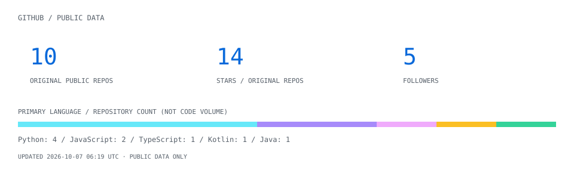

  

<h3 align="center">Hi, I'm Sincerelyplz 👋</h3>

  <picture>
    <source media="(prefers-color-scheme: dark)" srcset="./assets/intro-dark.svg" />
    
  </picture>

  <a href="https://www.asterh.me/">🌱 个人博客</a> &nbsp; · &nbsp;
  <a href="https://github.com/HuangJingwang?tab=repositories">🛠️ 项目代码</a> &nbsp; · &nbsp;
  <a href="https://github.com/HuangJingwang/practical-tech-writing">✍️ 技术写作</a>

最近在研究 **Voice Agent**，用 Pipecat 折腾实时语音交互。也做一点 RAG、会议助手和开发工具，遇到有意思的问题就写下来。

### 🎙️ 最近在折腾什么

- **语音对话**：音频怎么进出 Pipecat，Agent 怎么听、怎么回答、怎么被打断。
- **看屏幕、调工具**：让 Agent 理解投屏，再通过 MCP 调用业务工具。
- **会议里的知识**：用 RAG 补充上下文，生成的任务和文档先交给人确认。

📖 **[Pipecat：我的 Voice Agent 实践](https://www.asterh.me/posts/juejin-7680833071233531938)** 
从 Agora 接入到语音对话、投屏理解和工具调用，记录一个会议助手 MVP 的实现过程。

[会议交互：Tana 带来的启发](https://www.asterh.me/posts/juejin-7679977795863937064) · [知识检索：从 RAG 到 OKF 0.2](https://www.asterh.me/posts/rag-to-okf-02-part-1)

### 🧰 常用工具

   &nbsp;
   &nbsp;
   &nbsp;
  

Python · Java · TypeScript · Kotlin / 最近的关键词：Pipecat、MCP、RAG

### 🧪 一些实验和小工具

- **[RAG Knowledge Lab](https://github.com/HuangJingwang/rag-knowledge-lab)**，把原文、Chunk、向量检索与知识图谱摊开来看。
- **[ChatBot MCP](https://github.com/HuangJingwang/ChatBot-MCP)**，给聊天机器人接上外部服务和工具。
- **[Change Crew](https://github.com/HuangJingwang/change-crew)**，折腾 Codex 和编码 Agent 的多智能体协作。

展开其他项目

- **[Executable DDD](https://github.com/HuangJingwang/executable-ddd)**，把 DDD 边界落到 Java 代码、测试和可执行约束。
- **[Easy Yapi · Micronaut](https://github.com/HuangJingwang/easy-yapi-micronaut)**，为 easy-yapi 增加 Micronaut 注解识别与 JDK 21 支持。
- **[BrushUp](https://github.com/HuangJingwang/brushup)**，刷题同步、间隔复习与 AI 代码分析。

### ✍️ 最近写的

<!-- BLOG-POST-LIST:START -->
- [从 RAG 到 OKF 0.2：让会议助手用对知识（上）](https://www.asterh.me/posts/rag-to-okf-02-part-1)
- [从 RAG 到 OKF 0.2：让会议助手用对知识（中）](https://www.asterh.me/posts/rag-to-okf-02-part-2)
- [从 RAG 到 OKF 0.2：让会议助手用对知识（下）](https://www.asterh.me/posts/rag-to-okf-02-part-3)
<!-- BLOG-POST-LIST:END -->

[更多文章 →](https://www.asterh.me/posts)

### 👾 贡献格子，开饭了

<picture>
  <source media="(prefers-reduced-motion: reduce) and (prefers-color-scheme: dark)" srcset="./assets/pacman-contribution-graph-dark-still.svg" />
  <source media="(prefers-reduced-motion: reduce)" srcset="./assets/pacman-contribution-graph-still.svg" />
  <source media="(prefers-color-scheme: dark)" srcset="./assets/pacman-contribution-graph-dark.svg" />
  
</picture>

把这一年的贡献，交给吃豆人。

查看公开数据

 
<picture>
  <source media="(prefers-color-scheme: dark)" srcset="./assets/signal-dark.svg" />
  
</picture>

取自 GitHub 公开 API，每 6 小时尝试刷新；语言按仓库主语言数量统计。

---

**[Aster.H](https://www.asterh.me/)**，我的博客，记技术、项目和日常。 
**[Practical Tech Writing](https://github.com/HuangJingwang/practical-tech-writing)**，把技术实践写清楚的中文写作 Skill。

好奇的东西，写个 demo 看看。🐾
